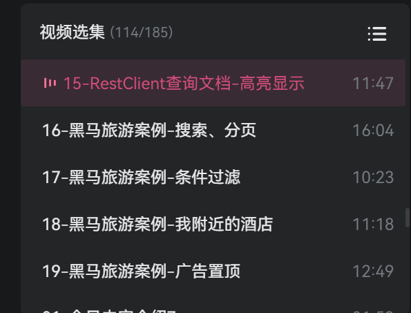

# 📝 2026-01-31 学习笔记

> **“日日寸进，不负热望**

## 🎯 Today

- [x] 前几天在刷虎哥的SpringCloud,不过很粗泛,目前到了实战的环节
  - [x] 

- [ ] 打算先放置微服务,将心思全部集中在八股四件和算法,然后skip课去刷实习的路线
  - [ ] 快速整理之前的项目笔记和包装产出: heima的外卖/点评 yupi的超级AI智能体
    - [ ] csdn中的别人博客专栏 + 配合倍速视频 => 整理笔记

  - [ ] 刷并且记忆理解四大件: MySQL、Redis、JUC、JVM , 和一小件MQ（RocketMQ/Kafka）
    - [ ]  ->  刷面经模拟/真实分享视频    +   小林coding/面试鸭  => 内化整理到笔记中

  - [ ] leetcode高频题: hot150(100+50)
    - [ ]  ->  labuladong 小抄 的算法速刷规划 (主) / b站灵茶山艾府 (辅)

## 📚 Study

### 1. SpringCloud

- cloud截止到进入黑马旅游的案例

### 2. SoftWare

- 熟悉了飞书的生态,补充了基本的企业开发的概念软件的常识性方面  

  > 之后用飞书进行知识库的管理,后续同步到OBsidian

## 🌟 Thinking & Plan

1. 分配好一天的学习各模块的时间, 信息源摄入过多的时候适当写写产出,欲速则不达
2. 适当劳逸结合,出去换换心情,做一个优雅的程序员👩‍💻