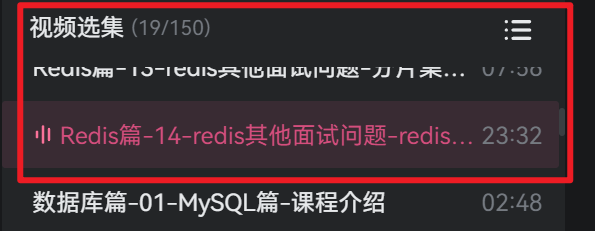
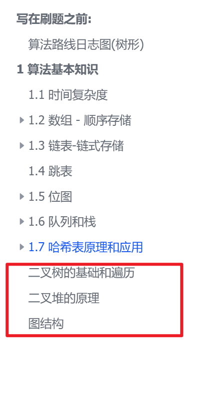
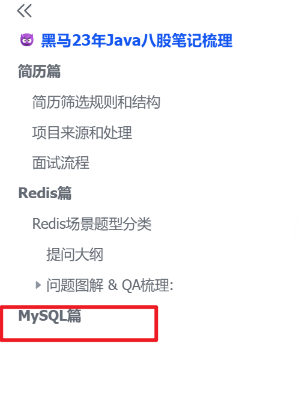

# 📝 2026-02-01 学习笔记

## 🎯 Today

- [x] 梳理 黑马的Java八股体系课程 **Redis篇** 飞书笔记 
  - [x] 飞书笔记链接:

     https://qcn6i1ylzcod.feishu.cn/wiki/NCt1wH3z1isTnFkDMwnc6yuanHe
  
  - [x] 黑马八股b站视频:
  
     
  
- [x] 在labuladong的算法小抄进行刷题
  - [x] 整理了算法速刷日志的“算法基本知识”, , 明天将算法的完善“写在刷题之前“的笔记板块
  
     https://qcn6i1ylzcod.feishu.cn/wiki/FGQ5wI4khiyWSmkkokecJzpHnLd?fromScene=spaceOverview

## 📚 Study

### 1. 视频观看 & 笔记梳理

梳理了算法的基本知识篇 和 Redis篇的八股. 整理到的位置如下 ↓ 

- 	

### 2. 背诵Redis的八股

- 还剩一小部分,应该还是没有合理安排时间的问题, 期间有些不懂的直接问了deepseek,还是不错的

  > 第一次背诵八股还是有些感觉的,理解之后脑子里面想着关系图然后复述, 也可能跟背诵的时间不长有关系吧哈哈

## 🌟 Thinking & Plan

1. 在刷视频的过程中就对照八股看, 然后优化八股措辞梳理到飞书笔记中

2. 明天完善算法入门篇的笔记,大概还是刷不了题… 然后继续开始Mysql的八股篇

   > 策略调整成 -> 每看视频的时候边结合原文的飞书笔记对照,然后转述成自己的语言风格整理到笔记中

   