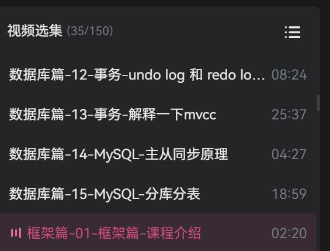
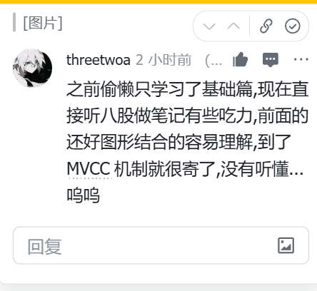

# 📝 2026-02-02 学习笔记

## 🎯 Today

- [x] 梳理 黑马的Java八股体系课程 **MySQL篇** 飞书笔记 

  - [x] 飞书笔记链接:

    https://qcn6i1ylzcod.feishu.cn/wiki/NCt1wH3z1isTnFkDMwnc6yuanHe

  - [x] 黑马八股b站视频:

    

- [x] labuladong的算法小抄-二叉树/图 梳理

  - [x] https://qcn6i1ylzcod.feishu.cn/wiki/FGQ5wI4khiyWSmkkokecJzpHnLd?fromScene=spaceOverview

## 📚 Study

### 1. 视频观看 & 笔记梳理

梳理了算法的二叉树和图论篇(还差一点,明天收尾) 和MySQL 篇的八股. 整理到的位置如下 ↓ 

- 
  - 不过自己先前学习MySQL的时候只看了基础篇, 看八股篇视频的时候有些吃力.. 尤其是mvcc,不过大部分还是看懂了
    - 

## 🌟 Thinking & Plan

1. 今天比较忙, 没有时间去背诵八股, 余下的时间看了mysql的八股篇, 有些难, 后续需要问问ai 进行解决

2. 明天结束算法入门篇的笔记,然后开始刷题, 然后继续开始框架的八股篇 应该会比较快了

   