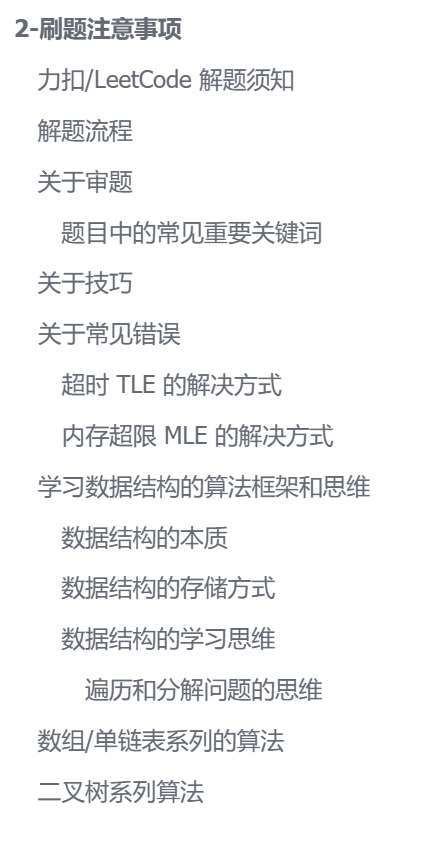
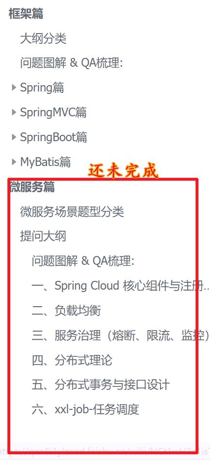
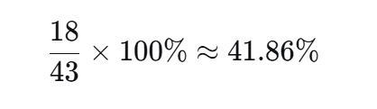

# 📝 2026-02-03 学习笔记

## 🎯 Today

- [x] 梳理 黑马的Java八股体系课程 **框架篇**飞书笔记 (**SSM**)

  - [x] 飞书笔记链接:

    https://qcn6i1ylzcod.feishu.cn/wiki/NCt1wH3z1isTnFkDMwnc6yuanHe

  - [x] 黑马八股b站视频:

    

- [x] labuladong的算法小抄-二叉树/图 的补充 和 刷题技巧梳理 

  - [x] https://qcn6i1ylzcod.feishu.cn/wiki/FGQ5wI4khiyWSmkkokecJzpHnLd?fromScene=spaceOverview
    - [x] 

## 📚 Study

### 1. 视频观看 & 笔记梳理

补充昨天没有写完的算法的二叉树和图论篇和SSM框架 篇的八股. 整理到的位置如下 ↓ 

- 

  其中的微服务篇没有完成, 只是整理了大纲, 明天会优先考虑中间件篇,也就是RabbitMQ, 微服务没有实际实践过,只是在阿里云的服务器进行过简单的部署

## 🌟 Thinking & Plan

1. ,看了SSM框架篇的八股,  之前看ssm篇比较潦草,是学完javaweb直接看的boot项目, 这次复习的八股就显得有些收获了

2.  明天开始刷算法,强度需要大一些,寒假已经过了,然后开始刷题, 然后继续开始框架的八股篇 应该会比较快了

   

   寒假已经过了快一半 还有不到25天的时间, 需要再卷起来! 