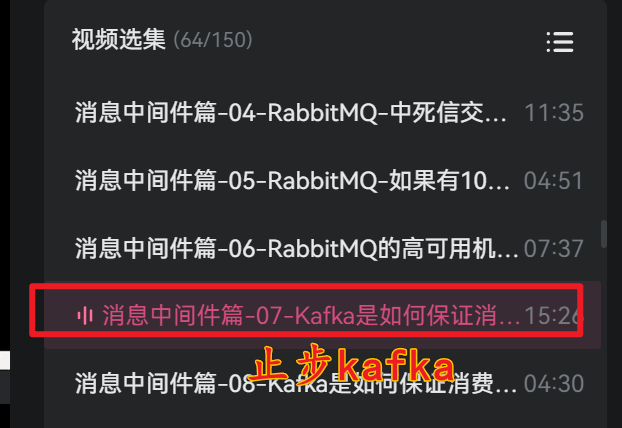
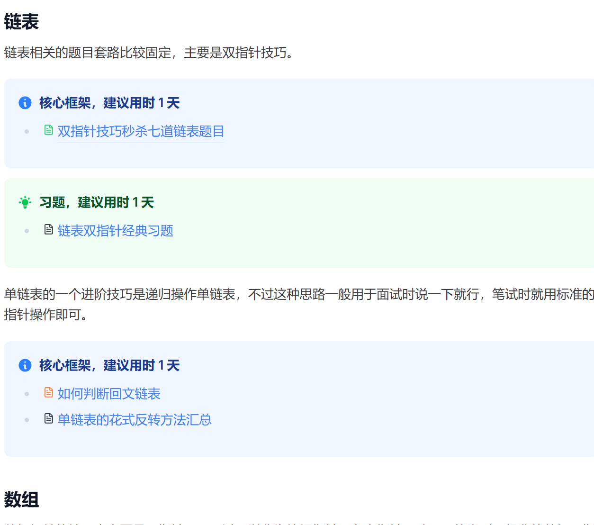
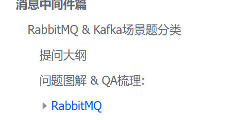
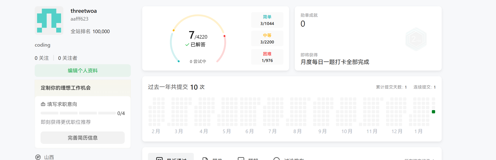

# 📝 2026-02-04 学习笔记

## 🎯 Today

- [x] 梳理 黑马的Java八股体系课程 **RabbitMQ篇**飞书笔记 

  - [x] 飞书笔记链接:

    https://qcn6i1ylzcod.feishu.cn/wiki/NCt1wH3z1isTnFkDMwnc6yuanHe

  - [x] 黑马八股b站视频:

    

- [x] labuladong的算法小抄-  

  - [x] https://qcn6i1ylzcod.feishu.cn/wiki/FGQ5wI4khiyWSmkkokecJzpHnLd?fromScene=spaceOverview
    - [ ] 开始刷题-双指针的七道题(已经是11点多了.. 害)
    - [x] 

## 📚 Study

### 1. 视频观看 & 笔记梳理

整理 RabbitMQ 篇的八股. 整理到的位置如下 ↓ 

- 

  今天的琐事比较繁忙, 回老家, 中午收拾了老半天, 下午去镇上烫头, 不过队伍比较长, 没有等到, 明天村里面有村长选举, 自己作为成年人要去投票了hh .. 

## 🌟 Thinking & Plan

1. ,看了RabbitMQ篇的八股,  可以看懂, 不过kafka没有事先学习过, 就没有看
2. 开始刷题, 情况还好,就是很多的api记忆还不是很熟练,尤其力扣的环境没有熟悉好… 配合这东哥的算法框架还是很好理解的!(15块买了一小黄鱼的一个pro的账号, 刷完调试完毕之后直接粘贴到主账号中hh)