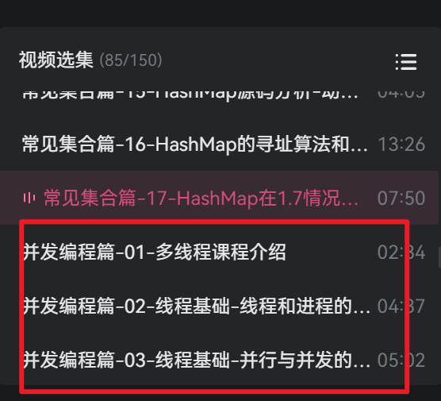
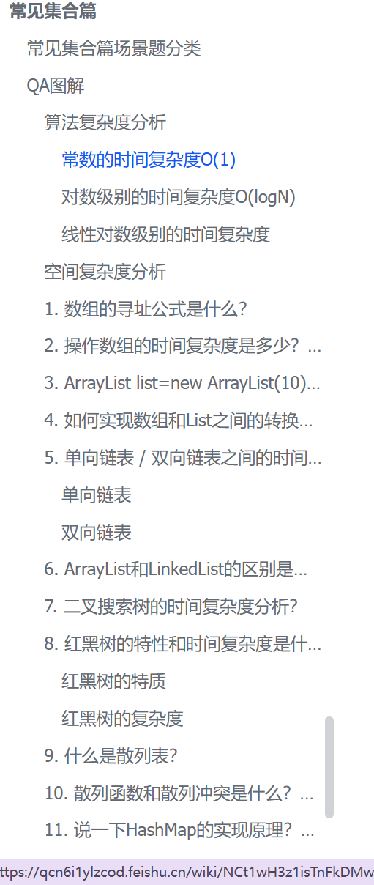
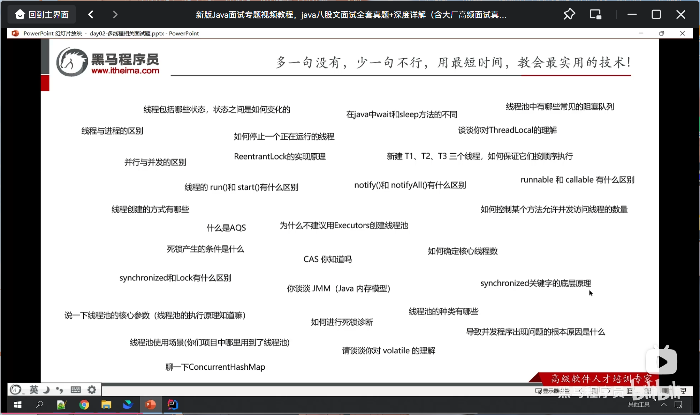
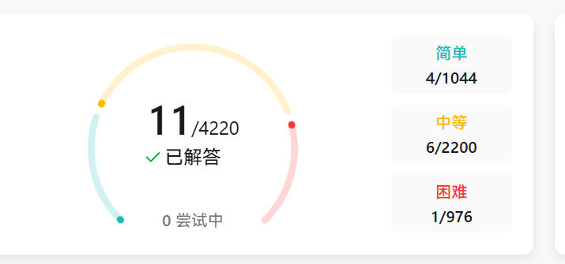

# 📝 2026-02-05 学习笔记

## 🎯 Today

- [x] 梳理 黑马的Java八股体系课程 **常见集合篇**飞书笔记 

  - [x] 飞书笔记链接:

    https://qcn6i1ylzcod.feishu.cn/wiki/NCt1wH3z1isTnFkDMwnc6yuanHe

  - [x] 黑马八股b站视频:

    

- [x] labuladong的算法小抄-  

  - [x] https://qcn6i1ylzcod.feishu.cn/wiki/FGQ5wI4khiyWSmkkokecJzpHnLd?fromScene=spaceOverview
    - [ ] 开始刷题-双指针的七道题(已经是11点多了.. 害)
    - [x] 

## 📚 Study

### 1. 视频观看 & 笔记梳理

整理 常见集合 篇的八股. 整理到的位置如下 ↓ 

- 

  今天比较慵懒, 对着大电视酷酷刷了b站, 还有帮点家里的活, 主要刷了cpu一些科技资讯, 北韩的将军恩情, 还有摩的师傅采访的接地气穷养的富二代

## 🌟 Thinking & Plan

1. ,看了常见集合篇的八股, 今天看的少, 早上复盘了昨天的7道双指针,然后额外刷了两道, 明天开始看并发编程篇

   

2. 总结笔记 + 复盘+刷题

   