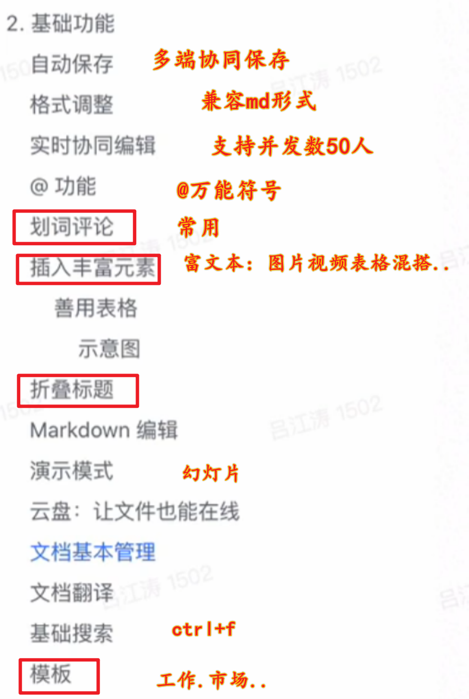

# 飞书功能和熟悉

> 提前熟悉飞书的功能和生态
>
> 2026年1月31日

## 通信

## 日程

## 基础

## 会议

## 工作台

## 原视频链接

视频链接: 【飞书官方详细教程视频（超全，建议收藏）】https://www.bilibili.com/video/BV1Bvxhe6EBC?vd_source=21c1c906628a6eeb013a2c9481ae651b

